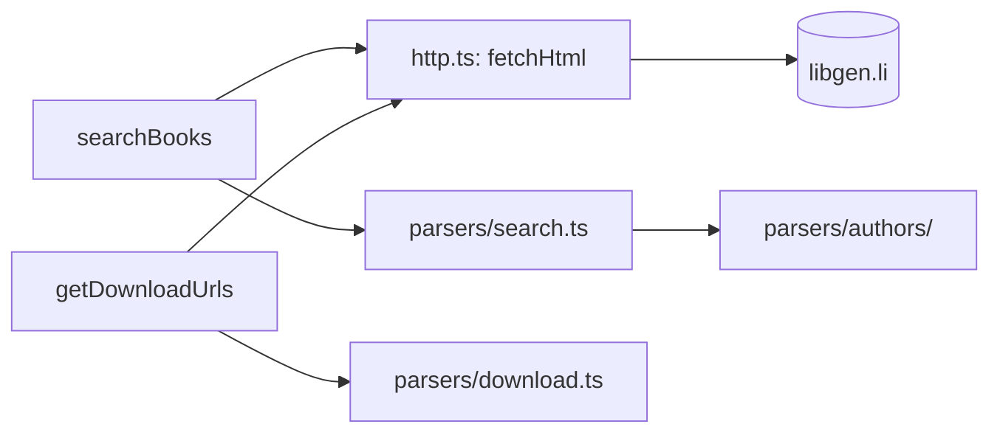

# Architecture

The package fetches libgen.li pages and extracts data from their HTML.
`searchBooks` fetches one page and parses it. `getDownloadUrls` fetches two
pages in parallel and parses each.

## Code map

| Path                                                    | Responsibility                                                                                             |
| ------------------------------------------------------- | ---------------------------------------------------------------------------------------------------------- |
| [`src/index.ts`](../src/index.ts)                       | The public API: re-exports `searchBooks`, `getDownloadUrls`, `LibraryFetchError` and the types.            |
| [`src/search.ts`](../src/search.ts)                     | `searchBooks`. Validates the query, builds the search URL, fetches it, and passes the HTML to the parser.  |
| [`src/download.ts`](../src/download.ts)                 | `getDownloadUrls`. Validates the ID, fetches `file.php` and `ads.php` in parallel, and collects the links. |
| [`src/http.ts`](../src/http.ts)                         | `fetchHtml` and the libgen.li base URL. The only code that calls `fetch`.                                  |
| [`src/errors.ts`](../src/errors.ts)                     | `LibraryFetchError`.                                                                                       |
| [`src/types.ts`](../src/types.ts)                       | `Book` and `DownloadUrls`.                                                                                 |
| [`src/parsers/search.ts`](../src/parsers/search.ts)     | Reads the rows of the results table into `Book` objects.                                                   |
| [`src/parsers/download.ts`](../src/parsers/download.ts) | Reads the IPFS link from a file page and the `get.php` link from an ads page.                              |
| [`src/parsers/authors/`](../src/parsers/authors/)       | Turns the free-text authors cell into a list of names. See [author parsing](authors.md).                   |

## Boundaries

- `search.ts` and `download.ts` do input validation and orchestration. They
  parse nothing themselves.
- Parsers take a string and return data. They do no I/O. The page parsers
  (`parsers/search.ts`, `parsers/download.ts`) take the HTML of a page and run
  against a saved one. The author parser takes the text of one authors cell.
- `parseIpfsUrl` and `parseGetPhpUrl` return `null` when the page has no link.
  `parseGetPhpUrl` also returns `null` when the link is not a valid URL.
  `parseRow` skips a row that has no id or no title.
- Errors are specified in the [API reference](api.md#errors).
- `search.ts` and `download.ts` choose the libgen.li page. The parsers know the
  markup of that page.

## Coupling to libgen.li

The parsers depend on the markup of libgen.li pages. A change to the site breaks
the parser that reads the changed page. The selectors are:

| Page                  | Selector                    | Read by                                       |
| --------------------- | --------------------------- | --------------------------------------------- |
| `index.php` (results) | `#tablelibgen > tbody > tr` | `parseSearchResults`; columns in `COL`        |
| `index.php` (title)   | `a[href^='edition.php']`    | `extractTitle`                                |
| `index.php` (ID)      | `a[href*='ads.php']`        | `extractMd5`, from the `md5=` query parameter |
| `file.php`            | `a[title="IPFS.io"]`        | `parseIpfsUrl`                                |
| `ads.php`             | `a[href*="get.php"]`        | `parseGetPhpUrl`                              |

When the site changes, refresh the matching page in
[`tests/fixtures/`](../tests/fixtures/), then fix the parser until the tests
pass.
